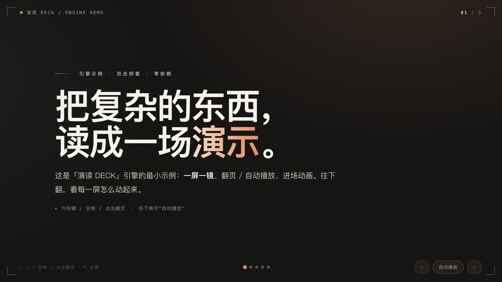
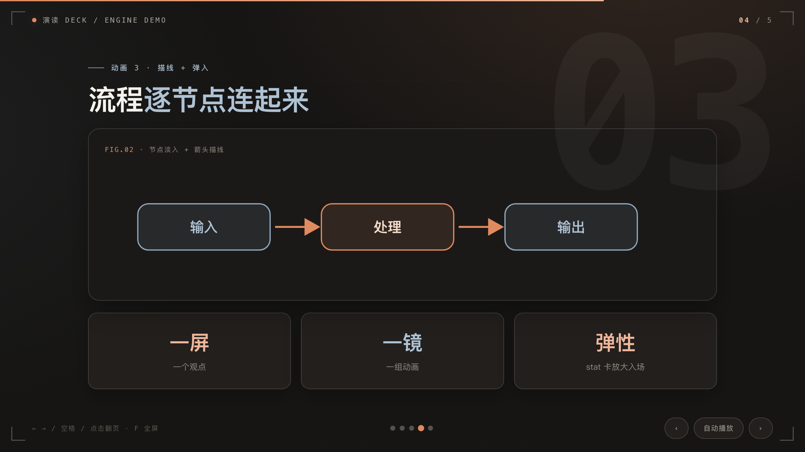

# hekouwang-yandu-deck-skill · YanDu DECK

**English** · [中文](README.md)

A [Claude Code](https://claude.com/claude-code) **Skill** by *会勇禾口王的AI笔记* — the production + publishing pipeline for **YanDu DECK** (演读 DECK), an immersive presentation format.

It turns an article into a **one-screen-per-idea, swipeable, auto-playing** keynote web deck (in **dark** or **light** theme), self-hosts its fonts (Noto Sans/Serif SC subsetted + Anthropic bundled, zero CDN, `preload` to kill FOUT), and deploys to Cloudflare Pages with one command.

Live example: **https://hekouwang.pages.dev**

## Demo

Fastest way to feel it — double-click **[`examples/demo.html`](examples/demo.html)**: a **self-contained, zero-dependency, system-font** minimal example. Just open it via `file://` to see the engine animate (paging / auto-play / bars growing / numbers counting up / lines drawing / staggered cards).

| Cover (count-up + gradient title) | Flow slide (nodes fade in + arrows draw + stat pop) |
|---|---|
|  |  |

- **Full live decks (swipeable / auto-play):**
  - Home: <https://hekouwang.pages.dev>
  - Dark series: <https://hekouwang.pages.dev/suanli/ep01> (`#3` jumps to slide 3)
  - Light series: <https://hekouwang.pages.dev/toushi/ep01>
- `assets/templates/deck-engine-暖黑.html` / `deck-engine-米白.html` are the two **full engine templates** (serve locally to load fonts: `python3 -m http.server`).

## Dependencies

| Dependency | Relationship | Notes |
|---|---|---|
| **`hekouwang-content-factory`** ⭐ | **Content source (hard dependency)** | This Skill is the *"turn content into a swipeable deck + publish"* half. The other half — generating the article HTML, the visual systems (V1/V2/V3), de-AI-ifying copy, compliance — lives in `hekouwang-content-factory`. Source HTML, color tokens and the font scheme all come from it. **⚠️ `hekouwang-content-factory` is a paid Skill** (contact the author @huiyonghkw for a license); its content is **not** included in this repo. |
| Python 3 + `fonttools` + `brotli` | Font subsetting | Only needed at publish time (the `tools/fenv` venv, see `SKILL.md`). Without it, it falls back to the pre-subsetted fonts in `fonts/cache/`. |
| `wrangler` (Cloudflare) | Deploy | `publish.py` calls it to deploy to CF Pages; first run needs `wrangler login`. |
| Anthropic Sans/Mono woff2 | Latin / mono fonts | From `hekouwang-content-factory` (self-use / demo license). If absent, Latin text falls back to system fonts. |

> Want just the **engine** (not the content pipeline)? Copy `assets/templates/deck-engine-*.html` as a template and fill in your content — that part is zero-dependency and stands alone.

## What is this

A Claude Code **Skill**, organized per the official `anthropics/skills` convention. `SKILL.md` is the method doc the agent reads; `scripts/` `assets/` `references/` `examples/` hold ready-to-copy scripts, templates, docs and samples.

```
SKILL.md                              # method + triggers + gotchas (agent entry point)
scripts/
└── publish.py                       # build dist/ → deploy to CF Pages (no 3rd-party deps)
assets/templates/
├── deck-engine-暖黑.html             # deck engine template (dark — data / finance / explainer)
├── deck-engine-米白.html             # deck engine template (light — editorial / methodology)
└── home.html                        # homepage template
references/
└── 系统说明.md                       # system notes (zh)
examples/
└── demo.html                        # self-contained zero-dep animated example
```

> Placement rule: copy `scripts/publish.py` and `assets/templates/home.html` into the **same** `演读DECK/` dir in your project (publish.py resolves the homepage via `SELF/home.html`).

## Install

Clone into `~/.claude/skills/hekouwang-yandu-deck-skill/`:

```bash
git clone git@github.com:huiyonghkw/hekouwang-yandu-deck-skill.git ~/.claude/skills/hekouwang-yandu-deck-skill
```

Then in Claude Code, say things like *"turn this into a deck / add a YanDu episode / publish to hekouwang"* and it auto-loads.

## Core features

- **Deck engine** (zero-dependency CSS+JS): full-screen one-idea-per-slide; arrow keys / space / click / touch paging; auto-play; entrance animations (staggered cards / growing bars / SVG line-draw / number count-up / ghost section numbers); `fit()` auto-scaling; `#N` deep links; `prefers-reduced-motion` friendly.
- **Two themes**: dark (data-console) / light (editorial) — the engine JS is theme-agnostic.
- **Self-hosted fonts**: Noto Sans SC (4 weights) + Serif subsetted to the glyphs actually used (~180KB each), Anthropic Sans/Mono bundled, zero external requests; `preload` + long cache to remove the first-paint weight flash.
- **One-command publish**: `python3 publish.py`; add one MANIFEST line per episode; clean URLs on CF Pages.

> For the companion article/graphics/video pipeline, see `hekouwang-content-factory`.

## License

The code in this repo (deck engine templates, `publish.py`, `demo.html`, `home.html`, `SKILL.md`, etc.) is **MIT** licensed — see [LICENSE](LICENSE). Note:

- **`hekouwang-content-factory` is a separate, paid Skill; its content is not in this repo** and is not covered by this license.
- Noto Sans SC / Noto Serif SC are SIL OFL fonts — **no font files are bundled here**; their OFL applies when you fetch them.
- Anthropic Sans/Mono are proprietary fonts, not bundled here; confirm your own licensing before use.
